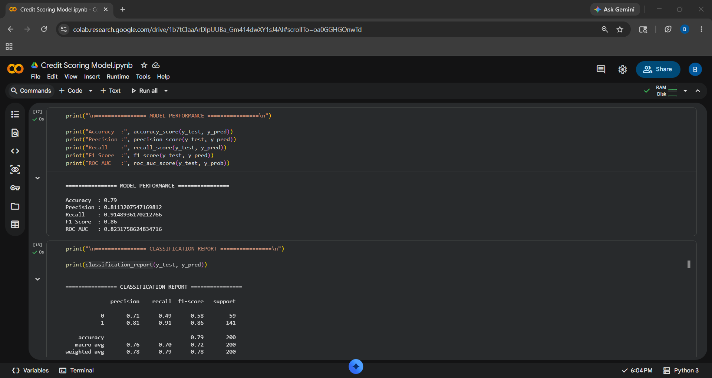
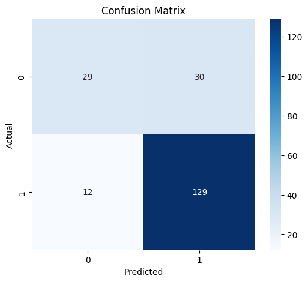
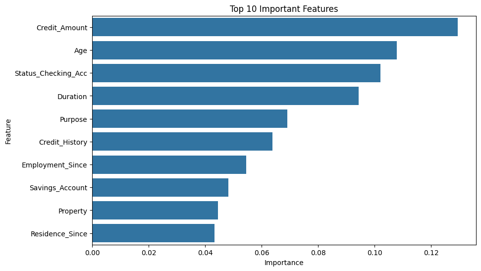

# Credit Scoring Model

A Machine Learning project that predicts whether a customer is creditworthy using financial history data.

## Algorithm Used

* Random Forest Classifier

## Features Used

* Credit Amount
* Age
* Loan Duration
* Employment Status
* Credit History
* Savings Account

## Evaluation Metrics

* Accuracy
* Precision
* Recall
* F1 Score
* ROC-AUC

## Technologies Used

* Python
* Pandas
* Scikit-learn
* Matplotlib
* Seaborn

## Dataset

German Credit Dataset from UCI Repository.

## Output Screenshots

### Model Output

### Confusion Matrix

### Feature Importance

